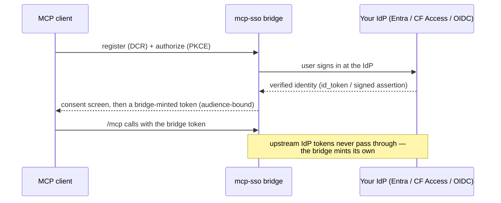

# mcp-sso

**OAuth in your MCP server, not an API key in your MCP client's config.**

[](https://www.npmjs.com/package/mcp-sso)
[](https://github.com/acartag7/mcp-sso/actions/workflows/ci.yml)
[](https://scorecard.dev/viewer/?uri=github.com/acartag7/mcp-sso)
[](LICENSE)
[](package.json)
[-blue)](docs/dependency-ledger.md)

[Quickstart](#quickstart) · [API-key gateway](#api-key-gateway-sso-in-front-of-a-token-only-backend) · [Machine-to-machine](#machine-to-machine-client_credentials) · [Supply chain](#security-is-the-product) · [Threat model](docs/threat-model.md) · [Live verification](#live-client-verification) · [Alternatives](#alternatives)

## The problem

Every remote MCP server needs to answer "who is calling me?" The fast answer is
an API key: generate one, paste it into the client's config, done.

```json
{
  "mcpServers": {
    "my-server": {
      "url": "https://api.example.com/mcp",
      "headers": { "Authorization": "Bearer sk-live-8f2c...N9f2" }
    }
  }
}
```

That key now lives forever in a plaintext config file, on every machine that
talks to the server. It has no expiry, no per-user identity, and no
revocation story short of rotating the one key everyone shares. It's what
security reviews flag, and what leaks in a `git add .` or a support
screenshot.

The MCP spec's actual answer is OAuth 2.1 with Dynamic Client Registration —
the client self-registers, the user sees a real sign-in/consent screen, and
the token that comes back is short-lived, per-user, and revocable:

```json
{
  "mcpServers": {
    "my-server": { "url": "https://api.example.com/mcp" }
  }
}
```

No secret in the config. The first connection pops a browser consent screen;
after that, the client holds a token and refreshes it on its own. This
trade-off — a login flow instead of a static credential — is why this
library exists: **OAuth in MCP servers, instead of API keys.**

The catch: MCP clients (claude.ai, ChatGPT, Claude Code, Cursor) require
Dynamic Client Registration (DCR) to self-onboard — the client calls a
registration endpoint on the identity provider to enroll itself
automatically. Many enterprise identity providers (Microsoft Entra ID, Okta,
Cloudflare Access) never built that endpoint. `mcp-sso` is the bridge: it
speaks DCR, PKCE, and consent to the MCP client, while your IdP stays the
identity source of truth. Upstream IdP tokens never pass through — the
bridge mints its **own** audience-bound tokens.



## What ships today

> **Status:** `v0.2.0` is live on npm ([`npm i mcp-sso`](https://www.npmjs.com/package/mcp-sso)).
> We've implemented and tested everything below; it passes the conformance
> suite on `main` — nothing here is aspirational. Not-yet-built work is
> called out separately in [Roadmap](#roadmap--not-yet-shipped-v03).

- **Resource-server verifier** (RS = Resource Server) — protects your `/mcp`
  endpoint:
  - Publishes discovery metadata so clients can find the authorization
    server (RFC 9728, served at the root and per-path).
  - Returns a proper `WWW-Authenticate` challenge when a token is missing or
    invalid, with a scope-based 403 step-up when more permission is needed.
  - **Fails closed on audience** — a token minted for a different resource
    is a hard rejection, never a degraded default.
- **AS-lite bridge** (AS = Authorization Server) — issues short-lived tokens
  instead of a static key:
  - Clients self-register (RFC 7591 DCR) and prove they hold the right
    authorization code with PKCE S256 (Proof Key for Code Exchange — proves
    the client that started the flow is the one finishing it).
  - Users see a real consent screen (approve or deny).
  - Refresh tokens rotate on every use, with theft detection if an old one
    gets replayed, and RFC 7009 revocation (`/oauth/revoke`).
  - Wire-compatible error bodies and metadata (RFC 6749 §5.2, RFC 9207,
    RFC 8414) so official MCP SDK clients just work.
  - **`client_credentials` grant** (the official MCP extension
    `io.modelcontextprotocol/oauth-client-credentials`) for headless /
    machine-to-machine callers — see
    [Machine-to-machine](#machine-to-machine-client_credentials) below.
- **Identity, pluggable:**
  - **Cloudflare Access** — verifies the header Cloudflare injects in front
    of your app, with an optional email allowlist.
  - **Microsoft Entra ID** (`/identity/entra`) — verifies OIDC (OpenID Connect, an identity
    layer on top of OAuth) tokens via auth-code + PKCE, resolves the right
    tenant automatically, checks the token wasn't replayed (nonce), and
    allowlists users by their stable object ID. A mounted **upstream
    redirect orchestrator** (`createUpstreamRedirectFlow`) drives the whole
    browser leg — signed single-use flow cookie, callback validation, code
    exchange — so you don't hand-roll the highest-risk OAuth code yourself.
    Optional **group-based authorization** maps Entra group membership
    (GUID-keyed) to a per-user scope ceiling, failing closed on group
    overage — the two-gate model is documented in
    [`docs/authorization.md`](docs/authorization.md).
  - **Console pairing** (`/identity/console-pairing`) — zero-setup identity for
    single-operator deployments: a one-time code prints to the server console
    and is pasted at the consent step. Real OAuth with **no IdP to stand up** —
    meant to be easier than generating an API key. It replaced the old
    `DEV_STUB_SUBJECT` dev bypass; see the single-operator boundary under
    [Live client verification](#live-client-verification) below.
- **Framework adapters** — `/fastify`, `/express`, `/hono`: thin route
  wiring, all logic lives in the framework-free core.
- **Stores** — `node:sqlite` (`/store/sqlite` — built into Node 24, **the
  recommended zero-ops production store** for a single-instance MCP server),
  `/store/mysql` (pooled `mysql2` — MySQL/MariaDB/PlanetScale-compatible, the
  scale path to a shared DB; optional peer dep), and an in-memory store for
  tests (`/store/memory`), all sharing
  one conformance suite (rotation backfill, family-validity sweep, single-use
  consent JTI) that any further downstream SQL adapter must also pass.
- **Rate limiting** — an optional `RateLimitPort` hook on the unauthenticated
  endpoints (`/oauth/register`, `/oauth/token`) with a Redis reference
  implementation (`/rate-limit/redis`, fixed-window, fail-open by design so a
  limiter outage never locks out auth). The limiter keys on the client IP:
  fastify/express use the framework's `req.ip` (configure `trustProxy` behind
  a proxy); hono takes an explicit `clientIp` extractor and never trusts
  `X-Forwarded-For` on its own.
- **Supply-chain posture** — `jose` is the only runtime dependency, every
  pin is at least 15 days old before we accept it, and npm publishes run
  only through GitHub Actions with Sigstore provenance — never from a local
  machine. Full policy in [Security is the product](#security-is-the-product)
  below.
- **A published threat model** (`docs/threat-model.md`) — a STRIDE table
  (the standard framework for categorizing threats), the replay-detection
  control, accepted boundaries, implementation gates.
- **An end-to-end verify gate** (`test/e2e-mcp-sdk.test.ts`) that drives the
  full flow — register → authorize → token → call the protected `/mcp` →
  refresh → replay-revocation observed → revoke — through the **official MCP
  SDK client**, not a hand-rolled stand-in.

Full contract surface: [`docs/contracts.md`](docs/contracts.md). Spec
conformance matrix: §16 there.

## Quickstart

```ts
import { createCloudflareAccessIdentity } from "mcp-sso/identity/cloudflare-access";
// see examples/fastify-sqlite/ for the full app (OAuth routes + a protected /mcp)
```

`examples/fastify-sqlite/` wires the bridge to Fastify + a `node:sqlite` store
and serves a minimal MCP server at `/mcp`, with the identity provider selected
by environment: Cloudflare Access (`CF_ACCESS_*` — Cloudflare injects
`Cf-Access-Jwt-Assertion`, the bridge verifies it), Microsoft Entra ID
(`ENTRA_TENANT_ID` / `ENTRA_CLIENT_ID` / `ENTRA_CLIENT_SECRET` /
`ENTRA_REDIRECT_URI` — the mounted redirect orchestrator drives the browser
leg), or zero-setup console pairing when neither is set.

<details>
<summary>Cloudflare Access invocation (full env)</summary>

```bash
OAUTH_ISSUER=https://auth.example.com \
OAUTH_RESOURCE=https://api.example.com/mcp \
OAUTH_CONSENT_SIGNING_SECRET=$(openssl rand -hex 32) \
OAUTH_SIGNING_PRIVATE_JWK='{"kty":"EC","crv":"P-256",...}' \
CF_ACCESS_AUDIENCE=... CF_ACCESS_CERTS_URL=... CF_ACCESS_ISSUER=... \
node examples/fastify-sqlite/index.ts
```

</details>

For zero-setup local dev (no IdP, no signing material to generate), the
standalone example auto-generates + persists its signing key and consent secret
([§17.8](docs/contracts.md)) and uses console pairing ([§17.5](docs/contracts.md)):
just `node examples/fastify-sqlite/index.ts` and paste the code printed to the
console. (Loopback http is permitted by default; override `OAUTH_ISSUER` /
`OAUTH_RESOURCE` to a real `https://` origin for a deployment.)

## API-key gateway: SSO in front of a token-only backend

The most common production shape: an internal MCP server (or plain API) that only
understands a **static API key**, shared with many people — and nobody wants to
hand that key out. Put a small gateway in front: users authenticate through your
real IdP (Entra, Cloudflare Access, any OIDC), the gateway verifies its own
short-lived tokens on `/mcp`, and the static key is injected **server-side only**.
It never reaches an MCP client, a laptop, or a config file.

A runnable worked example lives at [`examples/api-key-gateway/`](examples/api-key-gateway)
— mcp-sso as the SSO front door for a token-only stub backend MCP server, with the
backend credential isolated behind a `getBackendCredential()` closure and the full
transparent-proxy rules (Origin validation, the `WWW-Authenticate` failure path,
POST + GET/SSE + DELETE handling, client-`Authorization` stripping, header
allowlisting, SSE streaming) implemented and asserted by
[`test/integration-gateway.test.ts`](test/integration-gateway.test.ts).

```bash
BACKEND_API_KEY=$(openssl rand -hex 32) node examples/api-key-gateway/index.ts
# → identity is console pairing by default (paste the one-time code); set
#   CF_ACCESS_* or ENTRA_* for a real multi-user gateway. The gateway proxies
#   /mcp to the backend with the key injected server-side.
```

The pattern, the one-gateway-per-backend topology, and Kubernetes notes
(secrets take two separate code paths — signing material into `createBridgeConfig`,
the backend credential into the closure; it must never be placed in the config
input) are documented in [`docs/gateway-deployment.md`](docs/gateway-deployment.md).

## Machine-to-machine (`client_credentials`)

For headless callers — CI jobs, service agents, schedulers — where no human is
present to click a consent screen. Implements the official MCP extension
`io.modelcontextprotocol/oauth-client-credentials`.

Machine clients are **provisioned out-of-band** by an operator. Out-of-band
means there is no HTTP endpoint for this at all: you run
`provisionMachineClient` yourself — an admin script, a REPL, your own
provisioning tooling — constructed with the same `ClientStore` instance (or
one reading the same database) that the bridge is configured with, so the
record your script saves is the record the token endpoint later reads. Note
that `ClientStore` is a two-method port (`save`/`find`) **you implement
against your own database** — the shipped `/store/sqlite` and `/store/mysql`
adapters cover the OAuth `StorePort` (codes, refresh tokens, consent JTIs)
and do NOT provide a `ClientStore`. Machine-client records must survive
restarts, so back the port with real persistence (a one-table JSON store is
enough). The secret is returned once, to whoever ran the script. The open
`/oauth/register` endpoint rejects machine-shaped registrations by design
(the MCP extension itself states DCR is not used for this grant — and an HTTP
provisioning surface handing out durable secrets would be an attack surface).
Requirements: stored-DCR mode (`dcr: { mode: "stored", store }` — the
`ClientStore` above) and the explicit opt-in
`clientCredentials: { enabled: true }` in `createBridgeConfig` — a disabled
grant is never advertised in the discovery metadata.

```ts
import { provisionMachineClient, noopAudit } from "mcp-sso";

const { clientId, clientSecret } = await provisionMachineClient(
  { store: clientStore, catalog: config.scopeCatalog, clock: { nowMs: () => Date.now() }, audit: noopAudit },
  { name: "nightly-sync", allowedScopes: ["mcp:read"] }, // per-client scope ceiling, fixed at provisioning
);
// clientSecret (mcs_...) is returned ONCE and stored only as a SHA-256 hash —
// put it in your secret manager now; it cannot be retrieved again.
```

The machine exchanges its credential for a short-lived token (HTTP Basic shown;
`client_secret_post` also works — sending both is rejected per RFC 6749 §2.3):

```bash
curl -s https://auth.example.com/oauth/token \
  -u "$CLIENT_ID:$CLIENT_SECRET" \
  -d grant_type=client_credentials -d scope=mcp:read
# → { "access_token": "...", "token_type": "Bearer", "expires_in": <accessTokenTtlSeconds>, "scope": "mcp:read" }
```

The failure paths are RFC 6749 §5.2 wire errors: a wrong or expired secret or
an unknown client is `invalid_client` 401 (a failed **Basic** attempt also gets
a `WWW-Authenticate: Basic` challenge); a scope outside the client's ceiling —
or one later removed from the deployment's `scopeCatalog` — is `invalid_scope`.
**No refresh token is issued** (RFC 6749 §4.4.3 — the client already holds a
durable credential): request a new token when `expires_in` lapses. Rotate
secrets with `rotateMachineClientSecret` (up to two active secrets with a grace
overlap, default 24 h, so deploys don't race the rotation). The token's `sub`
is the `mcc_…` client id, and the prefix is reserved in both directions —
enforced at three points: a user-grant subject starting `mcc_` is rejected at
authorize, re-checked at token issuance (a stored grant from an older version
can't slip through), and mcp-sso's own verifier rejects any `mcc_` `sub` whose
`client_id` doesn't equal it (machine tokens always carry `sub == client_id`,
RFC 9068 — so even a still-valid access token minted by a pre-0.2.0 version
can't masquerade). If a third-party resource server reads these JWTs directly
instead of using mcp-sso's verifier, it should apply the same
`sub == client_id` check for machine classification — or, after upgrading from
a version that allowed `mcc_` human subjects, wait out `accessTokenTtlSeconds`
before trusting the prefix alone.
Full contract: [`docs/contracts.md`](docs/contracts.md) §17.2 / §9.4.

## Enterprise: the Entra DCR wall

Microsoft Entra ID is the canonical hard case. A remote MCP server wants to
trust Entra for identity. But MCP clients must DCR, and Entra has no DCR
endpoint. So either the server breaks every MCP client, or someone
hand-rolls bespoke OAuth glue per deployment.

`mcp-sso` backs the bridge with a published threat model, not just an
unverifiable "trust us." It handles DCR, PKCE, consent, and refresh rotation
for the client. It verifies the upstream identity — Cloudflare Access or
Entra ID today, a generic OIDC port on the roadmap — and issues its own
tokens.

The most common production shape — an SSO gateway in front of an internal
MCP server that only understands a static API key, so the key never reaches
a user — is documented in
[`docs/gateway-deployment.md`](docs/gateway-deployment.md), including the
one-gateway-per-backend topology and Kubernetes notes.

## Security is the product

- **Fail-closed everywhere** — ambiguous config, a missing identity, an
  unknown audience, or a replayed token is a hard failure, never a degraded
  default. There is no unauthenticated bypass in production configuration —
  see the fail-closed gates in [`docs/threat-model.md`](docs/threat-model.md).
- **A documented authorization model** —
  [`docs/authorization.md`](docs/authorization.md): where IdP-side access
  control (Entra app assignment / Conditional Access, Cloudflare Access
  policy) ends and mcp-sso's own defense-in-depth gates (subject allowlists,
  group→scope ceilings) begin.
- **Supply chain** — `jose` is the only runtime dep; we check every pin is
  at least 15 days old before accepting it (`minimumReleaseAge`, in minutes);
  CI actions are pinned by commit SHA; npm publishes run only through GitHub
  Actions with Sigstore provenance, never from a local machine. See
  [`docs/dependency-ledger.md`](docs/dependency-ledger.md).
- **Threat model** — [`docs/threat-model.md`](docs/threat-model.md): STRIDE
  table, the replay-detection control, the accepted boundaries, and the
  implementation gates.
- **Codes and tokens are hashed and single-use** — a leaked database dump
  doesn't hand out live credentials.
- **Separate signing keys for consent vs. access tokens, with algorithm
  pinning** — stops an attacker downgrading or reusing a key across
  purposes.
- **Timing-safe PKCE verification** — stops a timing side-channel from
  leaking the code verifier.
- **Redirect URIs are matched against an explicit allowlist** (RFC 8252
  loopback rules for native/local clients) — stops an open-redirect
  takeover of the auth flow.
- **Audit logging is metadata-only** — no tokens or codes ever land in a
  log. Reference sinks ship and are fail-open by design: a JSONL file sink
  (`0600`, append-only, log-injection-safe), an https-only no-redirect webhook
  sink, and `combineAudit(...sinks)` fan-out — an audit-write failure never
  blocks the auth flow. Deployer guide (three delivery paths, fail-open
  residual): [`docs/audit-deployment.md`](docs/audit-deployment.md).

## Alternatives

**Start here:** does your identity provider already speak DCR/OAuth 2.1? If
yes, you don't need a bridge — see `mcp-auth` below. If no (true for Entra,
Okta, and most enterprise SSO), that's exactly what this library does.

| Project | What it is | Choose it if… |
| --- | --- | --- |
| **mcp-sso** (this repo) | Resource-server verifier + a DCR/PKCE/consent bridge, with pluggable identity (Cloudflare Access, Entra ID, console pairing). | Your IdP doesn't speak DCR — Entra, Okta, most enterprise SSO. |
| [`mcp-auth`](https://github.com/mcp-auth/js) | Resource-server-only auth for Node MCP servers. | Your IdP **already** speaks DCR/OAuth 2.1 — [check the compatibility list](https://mcp-auth.dev/provider-list) — and you just need the resource-server wiring. |
| [`mcp-oauth-server`](https://github.com/wille/mcp-oauth-server) | A full OAuth 2.1 authorization server for MCP; ships `client_credentials` and device-code (RFC 8628) today. | You need **device flow** today — it's on our v0.3 roadmap (mcp-sso ships `client_credentials` as of v0.2.0) — and are fine bringing your own storage/consent/identity model. |
| [`workers-oauth-provider`](https://github.com/cloudflare/workers-oauth-provider) | Cloudflare's OAuth 2.1 provider library, KV-backed. | Your MCP server **is** a Cloudflare Worker. |
| Hosted SaaS (Stytch, WorkOS, Auth0, etc.) | Fully managed AS + identity. | You want zero self-hosted auth infrastructure and are fine with a vendor dependency and its pricing. |

## Roadmap — not yet shipped (v0.3)

- **GitHub / Google identity presets** — `GenericOidcIdentity` plus
  ready-made presets, refactoring the Entra port onto the same generic base.
- **Quickstart CLI** — an `npx mcp-sso init` wrapper around the shipped
  `loadOrCreateQuickstartSecrets` helper (the helper itself already ships).
- **CIMD** over the already-present SSRF-guarded `FetcherPort` boundary.
- **Device authorization flow (RFC 8628)** — for a human who must authorize
  from a device that can't receive a browser redirect (a CLI over SSH, a
  coding agent in sandboxed CI). Standard OAuth, not part of the MCP spec
  itself — a different problem than `client_credentials` (shipped in v0.2.0),
  which has no human at all.

## Conformance

### Spec conformance

Full requirement-by-requirement matrix (RFC 9728, 8414, 7591, 7009, 8707,
9207, PKCE, redirect policy, etc.): [`docs/contracts.md`](docs/contracts.md)
§16.

### Live client verification

The automated suite exercises the full flow through the **official MCP SDK
client**. Verifying against the real-world MCP clients people actually use
(claude.ai, ChatGPT, Claude Code, curl) is a manual step, tracked as a
**provider × client matrix** in [`docs/live-verification.md`](docs/live-verification.md)
— the single source of truth. Summary as of 2026-07-04:

- **✅ DCR/OAuth mechanics verified** (curl, official MCP SDK client, Claude Code,
  claude.ai) — these prove the client self-registers, the user sees a real consent
  screen, the bridge mints + the client presents an audience-bound token, and a tool
  round-trips.
- **† But NOT the production identity leg** — those runs used the example's local
  stub identity (`DEV_STUB_SUBJECT`, since removed), so they do NOT prove a real IdP
  (Cloudflare Access / Entra) authenticates the user fail-closed. That open work —
  Cloudflare Access × a live client, Entra × Claude Code / claude.ai, ChatGPT, and
  the api-key-gateway example — is tracked as `⬜ unverified` rows in the matrix, each
  with an exact owner-run checklist. A row flips to `✅` only when the owner runs it.

To run a quick **local** check yourself (Claude Code, no tunnel, no IdP):

```bash
# Zero-config: signing key + consent secret are auto-generated (§17.8) and identity
# is console pairing (§17.5). Paste the one-time code printed to the console.
node examples/fastify-sqlite/index.ts

# Claude Code (local — no tunnel):
claude mcp add --transport http my-bridge http://localhost:3000/mcp
#   → a browser opens to the consent page; approve; the tool is callable.
```

For claude.ai / ChatGPT you need a public `https` URL + a **real** identity provider
behind a named Cloudflare tunnel — do **not** tunnel the console-pairing path
(pairing is single-operator / loopback only; exposing it breaks its trust envelope).
The full provider × client matrix, the per-provider owner-run checklists
(Cloudflare Access, Entra, ChatGPT, the api-key-gateway example), and the tunnel
gotchas live in [`docs/live-verification.md`](docs/live-verification.md) and
[`docs/troubleshooting.md`](docs/troubleshooting.md).


## Contributing

Building, testing, and verifying changes locally is a development concern,
not a using-the-library one — see [`CONTRIBUTING.md`](CONTRIBUTING.md).

## License

MIT
