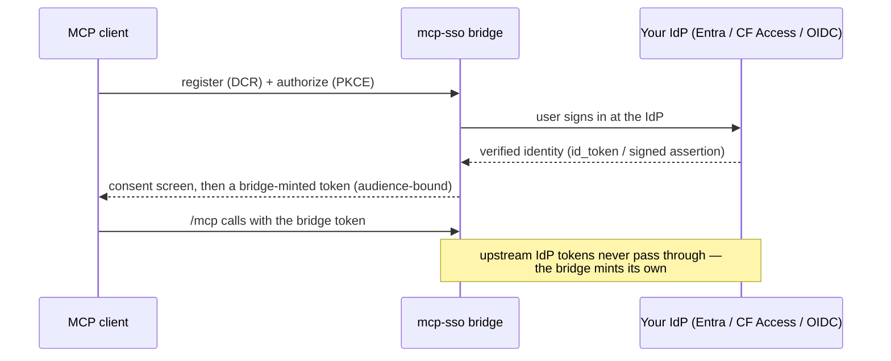

# mcp-sso

**OAuth in your MCP server, not an API key in your client's config.**

[](https://www.npmjs.com/package/mcp-sso)
[](https://github.com/acartag7/mcp-sso/actions/workflows/ci.yml)
[](https://scorecard.dev/viewer/?uri=github.com/acartag7/mcp-sso)
[](LICENSE)
[](package.json)
[-blue)](docs/dependency-ledger.md)

[Quickstart](#quickstart) · [Machine-to-machine](#machine-to-machine-client_credentials) · [API-key gateway](#api-key-gateway-sso-in-front-of-a-token-only-backend) · [Security](#security) · [Alternatives](#alternatives) · [Status](#status) · [Threat model](docs/threat-model.md) · [Live verification](docs/live-verification.md)

## The problem

Remote MCP servers need auth. The default is a static API key pasted into every
client config — no expiry, no per-user identity, no revocation short of rotating
the one shared secret. It's what leaks in a `git add .` or a support screenshot.

The MCP spec's answer is OAuth 2.1. But here's the catch: the clean self-onboarding —
paste a URL and the client connects — depends on **Dynamic Client Registration
(DCR)**: the client registers itself at the identity provider automatically, no
manual setup. The identity providers you actually have at work — **Entra ID,
Cloudflare Access, and most enterprise SSO — don't expose a DCR endpoint your
client can call.** So the paste-a-URL experience should just work… and against
enterprise IdPs, it doesn't. You're left hand-rolling OAuth glue per deployment,
or settling for manual registration that breaks the self-onboarding.

**mcp-sso is the bridge.** It speaks DCR, PKCE, and consent to the MCP client;
your IdP stays the identity source of truth; it mints its **own** audience-bound
tokens (each valid only for your server). Upstream IdP tokens never pass through.



## Quickstart

The fastest start needs no IdP and no keys to generate:

```bash
node examples/fastify-sqlite/index.ts
# → prints a one-time code to the console (console-pairing identity).
claude mcp add --transport http my-bridge http://localhost:3000/mcp
# → a browser opens to the consent page; approve; the tool is callable.
```

For a real identity provider (Cloudflare Access or Entra), set the env vars and
point the client at a public `https` URL — see
[`examples/fastify-sqlite/`](examples/fastify-sqlite) and
[`docs/live-verification.md`](docs/live-verification.md) for the exact setup
(including the named Cloudflare tunnel the public URL needs).

## What it works with

- **Identity providers:** Cloudflare Access, Microsoft Entra ID (redirect flow +
  group→scope authorization), zero-setup console pairing. *(Generic OIDC, Google,
  GitHub presets — v0.3.)*
- **Frameworks:** fastify, express, hono — thin adapters; all logic is in the
  framework-free core.
- **Stores:** `node:sqlite` (recommended, zero-ops), `mysql2`, in-memory — one
  shared conformance suite.
- **Grants:** authorization code (PKCE S256), refresh-token rotation with theft
  detection, `client_credentials` (M2M).
- **Runtime dependency:** `jose` only.

## Machine-to-machine (`client_credentials`)

For headless callers — CI jobs, service agents, schedulers. Implements the
official MCP extension `io.modelcontextprotocol/oauth-client-credentials`.

Machine clients are **provisioned out-of-band** — there's no HTTP endpoint for
it; you run `provisionMachineClient` against the same `ClientStore` the bridge
uses. `ClientStore` is a two-method port (`save`/`find`) **you implement against
your own database** — the shipped `/store/sqlite` and `/store/mysql` adapters are
`StorePort`-only (codes, refresh tokens, consent JTIs), not `ClientStore`. The
secret is returned once and stored only as a SHA-256 hash.

```ts
import { provisionMachineClient, noopAudit } from "mcp-sso";

const { clientId, clientSecret } = await provisionMachineClient(
  { store: clientStore, catalog: config.scopeCatalog, clock: { nowMs: () => Date.now() }, audit: noopAudit },
  { name: "nightly-sync", allowedScopes: ["mcp:read"] }, // per-client scope ceiling, fixed at provisioning
);
// clientSecret (mcs_…) is returned ONCE — put it in your secret manager now; it cannot be retrieved again.
```

```bash
curl -s https://auth.example.com/oauth/token -u "$CLIENT_ID:$CLIENT_SECRET" \
  -d grant_type=client_credentials -d scope=mcp:read
# → { "access_token": "…", "token_type": "Bearer", "expires_in": …, "scope": "mcp:read" }
```

Requires stored-DCR mode (`dcr: { mode: "stored", store }`) and
`clientCredentials: { enabled: true }` in `createBridgeConfig`. **No refresh
token** (the client already holds a durable credential). The `mcc_…` subject
prefix and a `gty: "client_credentials"` marker jointly identify machine tokens
— enforced at three points, detailed in [`docs/contracts.md`](docs/contracts.md)
§17.2. Rotate with `rotateMachineClientSecret`.

## API-key gateway: SSO in front of a token-only backend

The common production shape: an internal MCP server that only accepts a static
API key. Put mcp-sso in front — users authenticate through your real IdP, the
gateway verifies its own short-lived tokens on `/mcp`, and the static key is
injected **server-side only**. It never reaches an MCP client, a laptop, or a
config file. Worked example: [`examples/api-key-gateway/`](examples/api-key-gateway);
full pattern, topology, and Kubernetes notes in
[`docs/gateway-deployment.md`](docs/gateway-deployment.md).

## Security

- **Fail-closed everywhere** — ambiguous config, a missing identity, an unknown
  audience, or a replayed token is a hard failure, never a degraded default.
- **`jose` is the only runtime dependency**; every pin is ≥15 days old before we
  accept it; npm publishes run only through GitHub Actions with Sigstore
  provenance, never from a local machine.
- **Codes and tokens are hashed and single-use**; separate signing keys for
  consent vs. access tokens; timing-safe PKCE; redirect URIs matched against an
  explicit allowlist.
- **Published STRIDE threat model** + a documented two-gate authorization model
  (IdP-side access control vs. mcp-sso's defense-in-depth allowlists):
  [`docs/threat-model.md`](docs/threat-model.md),
  [`docs/authorization.md`](docs/authorization.md).

## Alternatives

Does your identity provider already speak DCR/OAuth 2.1? Then you don't need a
bridge — use [`mcp-auth`](https://github.com/mcp-auth/js) ([compatibility list](https://mcp-auth.dev/provider-list)).
If it doesn't (Entra ID, Cloudflare Access, most enterprise SSO), that's exactly
what mcp-sso is for.

| Project | Choose it if… |
| --- | --- |
| **mcp-sso** (this repo) | Your IdP doesn't speak DCR — Entra ID, Cloudflare Access, most enterprise SSO. |
| [`mcp-auth`](https://github.com/mcp-auth/js) | Your IdP **already** speaks DCR/OAuth 2.1; you just need resource-server wiring. |
| [`mcp-oauth-server`](https://github.com/wille/mcp-oauth-server) | You need **device flow** today (mcp-sso has `client_credentials`; device flow is v0.3). |
| [`workers-oauth-provider`](https://github.com/cloudflare/workers-oauth-provider) | Your MCP server **is** a Cloudflare Worker. |

## Status

mcp-sso is live-verified against real MCP clients — Claude Code, Codex CLI,
claude.ai, ChatGPT, and the official MCP SDK on a real Cloudflare Access tenant,
plus Entra ID (redirect flow) with Claude Code and Claude Desktop in a real
enterprise deployment. The full provider × client matrix lives in
[`docs/live-verification.md`](docs/live-verification.md).

## Roadmap (v0.3)

Generic OIDC + Google/GitHub identity presets · device authorization flow
(RFC 8628) · CIMD · `npx mcp-sso init`.

## License

MIT
