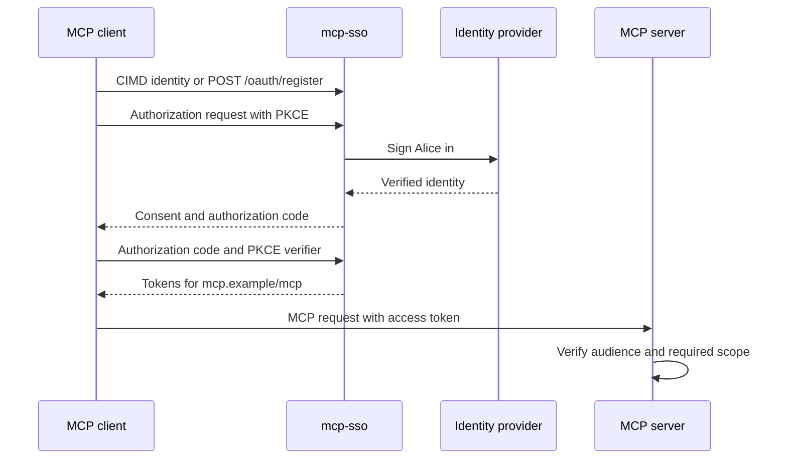

# mcp-sso

OAuth in your MCP server, without a static API key in every client configuration.

      [-blue)](docs/dependency-ledger.md)

[Get started](docs/getting-started.md) · [Documentation](docs/README.md) · [Configuration](docs/configuration.md) · [Security](docs/threat-model.md) · [Current verification status](docs/verification-status.md)

## The problem

Remote MCP servers need authentication. A shared API key gives every caller the same identity, has no per-user expiry, and usually requires a full rotation when one copy leaks.

MCP uses OAuth 2.1 instead. An MCP client must also identify itself to the authorization server. Clients can publish a Client ID Metadata Document (CIMD) or call `POST /oauth/register`. Identity providers such as Microsoft Entra ID and Cloudflare Access prove who the user is, but they do not expose the complete MCP authorization surface.

`mcp-sso` provides that surface. It accepts CIMD identities and `POST /oauth/register`, runs PKCE and consent with the MCP client, and uses the configured identity provider to authenticate the user. It then mints its own access and refresh tokens for one configured MCP resource. Tokens from the identity provider stay between the identity provider and `mcp-sso`.

## The authorization flow

Assume Alice connects an MCP client to `https://mcp.example/mcp`.

1. The client identifies itself through CIMD or `POST /oauth/register`.
2. `mcp-sso` sends Alice to the configured identity provider.
3. Alice returns with a verified identity and approves the requested scopes.
4. The client exchanges the authorization code and its PKCE verifier for tokens.
5. The MCP server verifies the access token's audience and required scope on each request.
6. Refresh-token rotation detects reuse and revokes the token family.

```mermaid
sequenceDiagram
    participant C as MCP client
    participant B as mcp-sso
    participant I as Identity provider
    participant S as MCP server
    C->>B: CIMD identity or POST /oauth/register
    C->>B: Authorization request with PKCE
    B->>I: Sign Alice in
    I-->>B: Verified identity
    B-->>C: Consent and authorization code
    C->>B: Authorization code and PKCE verifier
    B-->>C: Tokens for mcp.example/mcp
    C->>S: MCP request with access token
    S->>S: Verify audience and required scope
```

The resource-server verifier and the authorization-server bridge share a framework-free core. Fastify, Express, and Hono adapters translate HTTP requests and responses at the edge. Stores and identity providers sit behind ports, so changing deployment infrastructure does not change the OAuth rules.

## When to use it

Use `mcp-sso` when your identity provider authenticates users but does not expose MCP-compatible OAuth endpoints. The shipped identity ports cover Cloudflare Access, Microsoft Entra ID, Google, generic OIDC, and local console pairing.

Do not add this bridge when your identity provider already exposes the MCP authorization surface and supports a registration method used by your clients. In that case, use a resource-server library such as [`mcp-auth`](https://github.com/mcp-auth/js).

The [capability reference](docs/reference/capabilities.md) lists the shipped frameworks, stores, grants, registration methods, and deployment limits. The [documentation index](docs/README.md) separates tutorials, procedures, reference, explanation, and dated history.

## License

MIT
