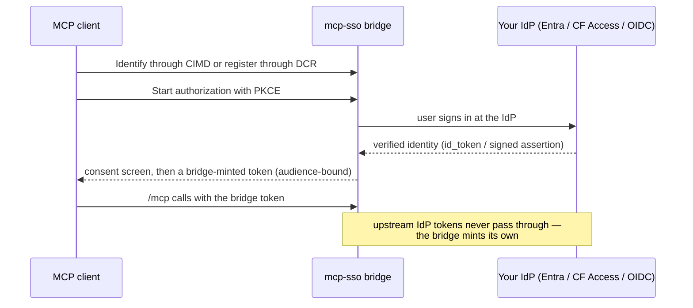

# mcp-sso

**OAuth in your MCP server, not an API key in your client's config.**

[](https://www.npmjs.com/package/mcp-sso)
[](https://github.com/acartag7/mcp-sso/actions/workflows/ci.yml)
[](https://scorecard.dev/viewer/?uri=github.com/acartag7/mcp-sso)
[](https://www.bestpractices.dev/projects/13556)
[](LICENSE)
[](package.json)
[-blue)](docs/dependency-ledger.md)

[Quickstart](#quickstart) · [Client registration](docs/client-registration.md) · [Configuration](docs/configuration.md) · [Machine-to-machine](#machine-to-machine-client_credentials) · [API-key gateway](#api-key-gateway-sso-in-front-of-a-token-only-backend) · [Security](#security) · [Alternatives](#alternatives) · [Roadmap](#roadmap) · [Threat model](docs/threat-model.md)

## The problem

Remote MCP servers need auth. The default is a static API key pasted into every
client config — no expiry, no per-user identity, no revocation short of rotating
the one shared secret. It's what leaks in a `git add .` or a support screenshot.

The MCP spec's answer is OAuth 2.1. The remaining gap is that an MCP client must
identify itself to an authorization server. Newer clients can use **Client ID
Metadata Documents (CIMD)**; other clients use **Dynamic Client Registration
(DCR)**. Enterprise identity providers such as Entra ID and Cloudflare Access
are identity sources, not MCP authorization servers, so they do not provide
this complete MCP-facing flow.

**mcp-sso is the bridge.** It accepts CIMD client identities and DCR clients,
then speaks PKCE and consent to the MCP client while your IdP stays the identity
source of truth. It mints its **own** audience-bound tokens (each valid only for
your server). Upstream IdP tokens never pass through.


```mermaid
sequenceDiagram
    participant C as MCP client
    participant B as mcp-sso bridge
    participant I as Your IdP (Entra / CF Access / OIDC)
    C->>B: Identify through CIMD or register through DCR
    C->>B: Start authorization with PKCE
    B->>I: user signs in at the IdP
    I-->>B: verified identity (id_token / signed assertion)
    B-->>C: consent screen, then a bridge-minted token (audience-bound)
    C->>B: /mcp calls with the bridge token
    Note over B,I: upstream IdP tokens never pass through —<br/>the bridge mints its own
```

## Quickstart

The fastest installed start needs Node 24+, no IdP, and no keys to generate:

```bash
npx mcp-sso init my-mcp-server
cd my-mcp-server
npm install
npm start
# In another terminal:
claude mcp add --transport http my-bridge http://127.0.0.1:3000/mcp
# → the server prints a one-time code; paste it into the browser, then approve.
```

The generated server enables CIMD and retains stateless DCR compatibility; the
client chooses which registration method it uses. The generated project is the
zero-setup console-pairing path. To run the repository's
real-identity-provider example instead, start from an **mcp-sso repository
checkout** (not the generated `my-mcp-server` directory), copy
[`docs/.env.example`](docs/.env.example) to `.env`, configure one of Cloudflare
Access, Entra ID, Google, or generic OIDC, and explicitly load it when starting
the env-driven
[`examples/fastify-sqlite/`](examples/fastify-sqlite) composition root:

```bash
# From the mcp-sso repository root:
corepack pnpm install --frozen-lockfile
cp docs/.env.example .env
# Edit .env, then:
node --env-file=.env examples/fastify-sqlite/index.ts
```

The examples do not load `.env` implicitly. See the
[configuration reference](docs/configuration.md), [identity-provider
guides](docs/identity/README.md), and [client-registration
guide](docs/client-registration.md).

## What it works with

- **Identity providers:** Cloudflare Access, Microsoft Entra ID (redirect flow +
  group→scope authorization), Google + generic OIDC sign-in, zero-setup console
  pairing.
- **Client registration:** CIMD recommended; stateless or stored DCR retained
  for clients that use it.
- **Frameworks:** fastify, express, hono — thin adapters; all logic is in the
  framework-free core.
- **Stores:** `node:sqlite` (recommended, zero-ops), `mysql2`, in-memory — one
  shared conformance suite.
- **Resources:** one issuer can protect a finite catalog of independently scoped
  MCP resource URLs; every grant, token, PRM route, and challenge stays pinned to one.
- **Grants:** authorization code (PKCE S256), refresh-token rotation with theft
  detection, `client_credentials` (M2M).
- **Runtime dependency:** `jose` only.

## Machine-to-machine (`client_credentials`)

For headless callers — CI jobs, service agents, schedulers. Implements the
official MCP extension `io.modelcontextprotocol/oauth-client-credentials`.

Machine clients are **provisioned out-of-band** — there's no HTTP endpoint for
it; you run `provisionMachineClient` against the same `MachineClientStore` the
bridge uses. You implement that port against your database; the shipped
`/store/sqlite` and `/store/mysql` adapters are `StorePort`-only (codes, refresh
tokens, consent JTIs), not `ClientStore`. Machine create, rotate, and disable
use versioned atomic mutations that commit the row with its durable audit. The
secret is returned once and stored only as a SHA-256 hash. A custom
`ClientStore.find(clientId)` must return the row whose embedded `clientId`
matches that lookup key; `parseMachineClientRegistration` rejects mismatched or
malformed machine rows before verification, mutation, or token issuance.

```ts
import { provisionMachineClient, noopAudit } from "mcp-sso";

const { clientId, clientSecret } = await provisionMachineClient(
  { store: clientStore, catalog: config.scopeCatalog, clock: { nowMs: () => Date.now() }, audit: noopAudit },
  { name: "nightly-sync", allowedScopes: ["mcp:read"] }, // per-client scope ceiling, fixed at provisioning
);
// clientSecret (mcs_…) is returned ONCE — put it in your secret manager now; it cannot be retrieved again.
```

```bash
curl -s https://auth.example.com/oauth/token -u "$CLIENT_ID:$CLIENT_SECRET" \
  -d grant_type=client_credentials -d scope=mcp:read
# → { "access_token": "…", "token_type": "Bearer", "expires_in": …, "scope": "mcp:read" }
```

Requires stored-DCR mode (`dcr: { mode: "stored", store }`) and
`clientCredentials: { enabled: true }` in `createBridgeConfig`. **No refresh
token** (the client already holds a durable credential).
`RequestAuthorizer.authorize()` returns
`credentialKind: "machine" | "interactive"` after it verifies the token.
Use that field for downstream policy; do not decode the JWT or infer from an
`mcc_…` prefix. Machine classification requires the complete `mcc_` subject,
`sub === client_id`, and `gty: "client_credentials"` binding — enforced at
three points, detailed in
[§17.2](docs/contracts/17-v0-2-feature-contracts.md#172-client_credentials-grant-mcp-extension-iomodelcontextprotocoloauth-client-credentials).
Rotate with `rotateMachineClientSecret` (the published 24-hour default is also
the hard maximum; pass a shorter overlap such as 5 minutes explicitly), or
revoke future token issuance with the atomic
`disableMachineClient` tombstone.

## API-key gateway: SSO in front of a token-only backend

The common production shape: an internal MCP server that only accepts a static
API key. Put mcp-sso in front — users authenticate through your real IdP, the
gateway verifies its own short-lived tokens on `/mcp`, and the static key is
injected **server-side only**. It never reaches an MCP client, a laptop, or a
config file. Worked example: [`examples/api-key-gateway/`](examples/api-key-gateway);
full pattern, topology, and Kubernetes notes in
[`docs/gateway-deployment.md`](docs/gateway-deployment.md).

## Security

- **Fail-closed everywhere** — ambiguous config, a missing identity, an unknown
  audience, or a replayed token is a hard failure, never a degraded default.
- **Finite JWT operation clocks** — access/consent verification rejects
  non-integer or non-canonical custom `ClockPort` values and preserves the
  existing typed OAuth failure through the production request and
  approval paths ([threat-model row 39](docs/threat-model.md)).
- **Optional request budgets** — `RateLimitPort` runs before registration,
  token exchange, and direct header-based identity verification
  (`Bridge.resolveIdentity`); its default is intentionally no-op, so production
  deployments wire the Redis adapter or a trusted rate-limiting proxy.
- **Reference `/mcp` Origin gates reject ambiguity** — the runnable examples use
  `headersFromDistinct` plus `readHeader`, and the generated server checks
  `request.raw.headersDistinct.origin` inline, before parsing or bearer
  authorization. Custom `/mcp` mounts own the same DNS-rebinding check.
- **Browser-compatible consent return** — `Bridge.handleAuthorize` sends `Referrer-Policy:
  same-origin`, so the approval POST retains its issuer `Origin`, and its CSP
  must omit `form-action` so Chromium can follow the POST's 302 to the client
  callback. `assertApproveOrigin` keeps its exact issuer-or-allowlist check,
  with no automatic opaque-Origin fallback.
- **`jose` is the only runtime dependency**; every pin is ≥15 days old before we
  accept it; npm publishes run only through GitHub Actions with Sigstore
  provenance, never from a local machine.
- **Token handling**: authorization codes and refresh tokens are hashed at rest
  and single-use (a replayed refresh token revokes its whole family); consent
  tokens are single-use. `OAuthTokenUseCase.exchangeAuthorizationCode` prepares
  the signed response before saving refresh state;
  `OAuthTokenUseCase.refresh` attempts to revoke the rotated family if any later
  response preparation step fails and returns no token; durable compensation
  still depends on the configured store accepting that write. All
  `OAuthTokenUseCase` audit writes are contained by `writeTokenAudit`. **Access tokens are
  short-TTL ES256 bearer tokens — like
  any OAuth access token, a stolen one is valid until `exp`** (no access-token
  introspection or revocation in v0.2; [threat-model row 1](docs/threat-model.md)).
  Separate signing keys for consent vs. access; timing-safe PKCE; redirect URIs
  matched against an explicit allowlist.
- **Published STRIDE threat model** + a documented two-gate authorization model
  (IdP-side access control vs. mcp-sso's defense-in-depth allowlists):
  [`docs/threat-model.md`](docs/threat-model.md),
  [`docs/authorization.md`](docs/authorization.md).

## Alternatives

Does your identity provider already expose an MCP-compatible OAuth 2.1
authorization surface, including a registration method your clients support?
Then you don't need a bridge — use
[`mcp-auth`](https://github.com/mcp-auth/js) ([compatibility
list](https://mcp-auth.dev/provider-list)). If your IdP is only the upstream
identity source (Entra ID, Cloudflare Access, most enterprise SSO), that is what
mcp-sso bridges.

| Project | Choose it if… |
| --- | --- |
| **mcp-sso** (this repo) | Your IdP is not an MCP authorization server — Entra ID, Cloudflare Access, most enterprise SSO. |
| [`mcp-auth`](https://github.com/mcp-auth/js) | Your IdP already exposes compatible OAuth 2.1 client registration; you just need resource-server wiring. |
| [`mcp-oauth-server`](https://github.com/wille/mcp-oauth-server) | You need **device flow** today (mcp-sso has `client_credentials`, not device flow). |
| [`workers-oauth-provider`](https://github.com/cloudflare/workers-oauth-provider) | Your MCP server **is** a Cloudflare Worker. |

## Roadmap

After 0.3.0, the next planned areas are:

- **Device authorization (RFC 8628)** for interactive login from SSH sessions,
  terminals, and other environments that cannot receive a browser callback.
- **GitHub identity** for teams that use GitHub as the upstream login provider.
- **Multi-resource deployments** so one authorization service can protect
  multiple MCP audiences without weakening audience isolation.
- **PostgreSQL storage and additional provider presets** when real deployments
  justify them.

## License

MIT
