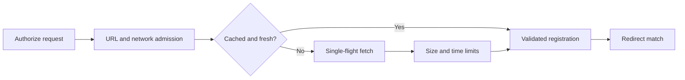

# Why CIMD fetching needs several limits

A CIMD `client_id` is a URL chosen by the client. The authorization server must fetch that URL before it can trust the client's redirect URI. This creates an outbound network request on an unauthenticated path.

The controls solve different parts of that problem. None replaces the others.



## Network reach

The guarded fetcher rejects private, loopback, special-use, and rebinding targets in production. This prevents a client from using the authorization server to reach internal services. `dev.allowInsecureLocalhost` opens only the loopback development case.

> [!IMPORTANT] The network guard limits where a request can go. It does not limit how many accepted public URLs a caller can submit.

## Repeated requests

The success cache can reuse a validated document only when its HTTP freshness metadata is safe for the shared cache. `private`, `no-store`, `no-cache`, `Vary: *`, malformed freshness fields, and a lifetime below 60 seconds force a new fetch.

Single-flight combines concurrent requests for the same raw `client_id`. One request starts the fetch; the others wait for its result. `maxInFlight` limits distinct outbound fetches. `maxWaitersPerFetch` limits how many callers can wait behind one fetch.

The maximum number of waiting CIMD resolutions is:

```text
maxInFlight × (maxWaitersPerFetch + 1)
```

The extra one is the request that started each fetch. With the defaults, the bound is `8 × (256 + 1) = 2056` waiting resolutions.

The waiter limit exists because single-flight reduces network traffic but does not make waiting requests free. Before the cap, 10,000 same-client resolutions produced one fetch while retaining about 15.4 MB for the waiting request chains. The default of 256 preserves a reasonable same-client startup burst while placing a hard ceiling on that amplification.

> [!WARNING] `cimd:<ip>` uses the optional `RateLimitPort`. If the composition omits that limiter, sequential requests for many distinct valid public client IDs still cause sequential guarded fetches. The network, concurrency, waiter, timeout, and size controls bound each request, but they do not create a per-caller request budget.

## The signed carry-forward

In upstream redirect mode, the server resolves the document before sending the user to the identity provider. It places only the validated `CimdRegistration` fields in the signed flow cookie. The callback consumes that registration without fetching the document again.

This prevents the document from changing between the authorization decision and the callback. It also gives redirect mode a second size limit: the projected registration must fit in the 4096-byte flow cookie even when the original document fits within `maxDocumentBytes`.

The exact limits and failure responses are in [contract §17.1](../contracts/17-v0-2-feature-contracts.md#171-cimd-client-id-metadata-documents-the-ssrf-enforcement-contract). The deployment consequences are in the [threat model](../threat-model.md).
