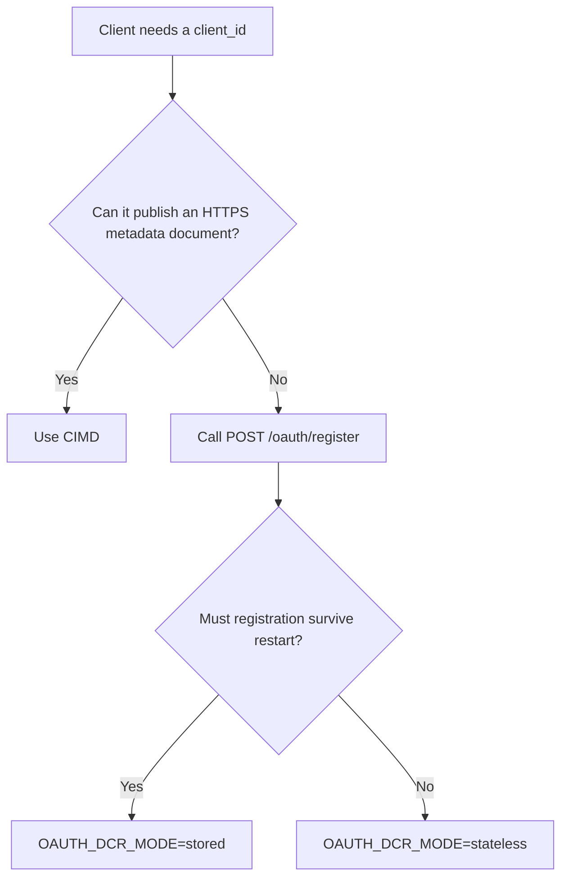

# Choosing a client registration path

An OAuth authorization server must know which redirect URI belongs to a client. `mcp-sso` supports two ways to establish that information: the client can publish a Client ID Metadata Document, or it can call `POST /oauth/register`.

## The decision



| Path | Source of redirect trust | Persistent client record | Common use |
| --- | --- | --- | --- |
| CIMD | The validated HTTPS document named by `client_id` | No | Hosted clients that can publish metadata |
| `POST /oauth/register` with `OAUTH_DCR_MODE=stateless` | `BridgeConfig.redirectAllowlist` | No | Compatibility clients whose registration does not need to survive restart |
| `POST /oauth/register` with `OAUTH_DCR_MODE=stored` | `BridgeConfig.redirectAllowlist` at registration, then the saved `ClientRegistration` at authorization | Yes | Native clients with ephemeral callbacks or deployments that need durable registration |

## CIMD

A CIMD client uses the URL of its metadata document as `client_id`. The document states `client_name`, `redirect_uris`, and supported OAuth metadata. `CimdResolver.resolve` validates the URL, fetches the document through the guarded transport, validates the document, and checks the presented redirect URI.

The document is not proof that the display name is trustworthy. The consent page shows the client ID host and redirect host as the identity anchors. It marks `client_name` as self-reported text.

> [!IMPORTANT] A lowercase `https://` client ID selects CIMD. If CIMD is disabled, that client ID returns `invalid_client`. It does not fall back to DCR.

## `POST /oauth/register`

`POST /oauth/register` accepts public-client metadata. It requires `redirect_uris`, accepts `application_type` as `"native"` or `"web"`, and returns an opaque `mcpdc_` client ID. It rejects a machine-client request. Machine clients are provisioned out of band because anonymous registration must not mint a client secret.

Stateless mode validates the request and returns the client ID without calling `ClientStore.save`. Authorization later applies the global redirect allowlist because no client record exists.

Stored mode calls `ClientStore.save` after validation. Authorization later loads that record and applies the stored `applicationType` and registered redirect URIs. A native loopback callback can keep its scheme, host, path, and query while selecting a new port at runtime.

> [!WARNING] `OAUTH_DCR_MODE=stored` lets anonymous callers create durable records. Supply a bounded `RateLimitPort`. If `RateLimitPort.check` throws, `Bridge.handleRegister` returns 503 before it selects request fields or calls `ClientStore.save`.

## Example choices

A hosted client that publishes `https://client.example/oauth.json` uses that exact URL as `client_id`. Its document must list the callback it presents.

A CLI that binds a different loopback port on each run can call `POST /oauth/register` with a native callback:

```json
{"application_type":"native","redirect_uris":["http://127.0.0.1:49152/callback"],"token_endpoint_auth_method":"none"}
```

Choose `OAUTH_DCR_MODE=stored` when that registration must survive a process restart. Choose stateless mode when persistence is unnecessary and the global redirect allowlist is the intended authorization-time policy.

The [client registration guide](../client-registration.md) contains configuration steps. [Contract §9.2](../contracts/09-as-lite-bridge-contract.md#92-dcr-registerclient-rfc-7591-deprecated-compatibility-path) and [contract §10](../contracts/10-redirect-uri-policy.md) define the exact validation rules.
