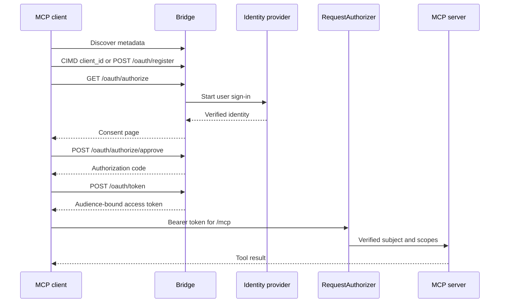

# How the OAuth roles fit together

An MCP client needs more than a user login. It must discover the authorization server, identify itself, send the user through authorization, obtain a token for one MCP resource, and present that token to `/mcp`. The upstream identity provider handles the user login. `mcp-sso` handles the MCP-facing OAuth protocol and mints the token that the MCP server accepts.

## The actors

| Actor | What it proves or controls |
| --- | --- |
| MCP client | Its callback and requested scopes. It identifies itself through CIMD or `POST /oauth/register`. |
| Upstream identity provider | Who the user is. Examples are Cloudflare Access, Microsoft Entra ID, and Google. |
| `Bridge` | Client registration, authorization, consent, token exchange, refresh, and revocation. |
| `RequestAuthorizer` | Whether the bearer token can call the configured MCP resource with the required scope. |
| MCP server | The tools and data protected by `/mcp`. |

The upstream identity provider does not mint the token used at `/mcp`. Its credential reaches an `IdentityPort`, which returns a resolved subject and optional scope ceiling. `Bridge` then mints its own access token for the exact `BridgeConfig.resource`.

## Why the bridge mints another token

An upstream token describes an upstream application and audience. The MCP server needs a token bound to its own resource. Passing the upstream token through would couple the MCP server to provider-specific token shapes and could let a token intended for one audience reach another service.

`BridgeConfig.resource` is the boundary. The authorization code and refresh-family records carry that exact resource. The access token carries it as the audience. `RequestAuthorizer.authorize()` rejects a token whose audience does not match its configured resource.

> [!WARNING] Do not forward an upstream identity-provider token to the MCP client or backend. Give the MCP client the token minted by `Bridge`, and pass that token through `RequestAuthorizer.authorize()` before protected handler work.

## Where a request stops

A request can stop before user login, after identity verification, at consent, during token exchange, or at `/mcp`. These are different failures:

| Failure | Observable result |
| --- | --- |
| Client ID or redirect URI is invalid | Authorization returns a direct OAuth error. It does not redirect to an untrusted URI. |
| Identity provider stops the user before callback | The provider shows its denial. mcp-sso receives no accepted identity and mints no authorization code. |
| `IdentityPort` rejects the credential after the request reaches mcp-sso | `Bridge.resolveIdentity` throws an `OAuthError` with `error=access_denied`. The Fastify, Express, and Hono routes catch it and return a direct `401`. A custom adapter must handle the throw on the same direct, pre-validation error path. No authorization code is minted. |
| User denies consent | The client receives the consent denial through its validated redirect URI. |
| Authorization code, PKCE verifier, client binding, or resource binding is wrong | `POST /oauth/token` returns `invalid_grant`. No access token is minted. |
| Access token has the wrong audience or lacks a required scope | `RequestAuthorizer.authorize()` rejects the `/mcp` request. |

The [authorization model](../authorization.md) explains the identity and scope gates. The [contracts](../contracts.md) provide the exact request, record, and error shapes.
