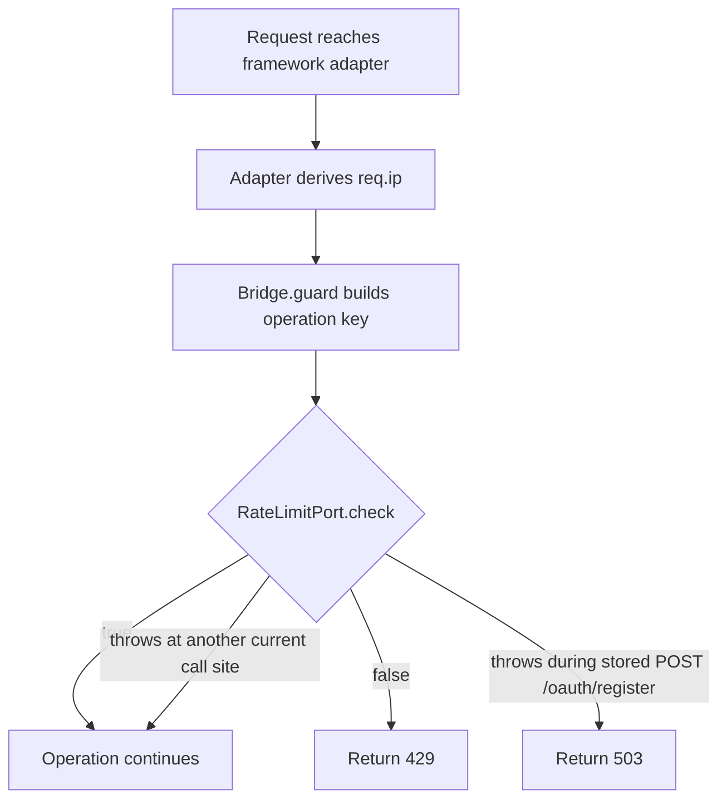

# Why rate limits depend on client IP trust

`RateLimitPort` receives a string key such as `register:<ip>` or `authorize:<ip>`. The limiter can separate callers only when the adapter supplies an IP address derived from the actual network path. A forwarded header is not trustworthy merely because it contains an IP address.

## The request path



The key prefix separates operation budgets. It does not make the IP trustworthy. Fastify uses `req.ip`, Express uses `req.ip`, and Hono uses the deployer's `clientIp(c)` function.

## Reverse proxies

For Fastify, configure `trustProxy`. For Express, configure `trust proxy`. The setting must match the proxies that actually sit between the client and the application.

> [!WARNING]
> If the framework trusts a hop that clients can reach directly, a caller can choose a forwarded IP address and therefore choose its rate-limit bucket. If the framework trusts no real proxy hop, every proxied caller can share the proxy's bucket and block one another.

For Hono, derive `clientIp(c)` from the trusted runtime or a validated proxy chain. Do not return a client-supplied header directly. Hono rejects `BridgeConfig.dcr.mode === "stored"` at boot when `clientIp` is missing. In non-stored configurations, a missing extractor uses `<prefix>:unknown`, so all callers share one bucket.

## Why `POST /oauth/register` is different

Most current `RateLimitPort` call sites continue when the limiter throws. That preserves availability for authorization, consent, token, revocation, upstream, CIMD, and pairing work.

Stored `POST /oauth/register` is the exception because it can create a durable record for an unauthenticated caller. If the limiter throws, `Bridge.guard` raises `temporarily_unavailable`, and `Bridge.handleRegister` returns 503 before body selection, `ClientStore.save`, or the registration success audit.

```text
missing stored-mode Hono extractor  -> boot rejection
missing or invalid runtime IP       -> 400 before RateLimitPort.check
RateLimitPort.check returns false -> 429
RateLimitPort.check throws         -> 503 in stored mode
RateLimitPort.check returns true  -> parse and validate, then save
```

This distinction is about reached code, not intent. Adapter body-size checks can reject a request before `Bridge.guard`. `Bridge.handleRegister` also rejects a missing, empty, non-string, or literal `"unknown"` runtime IP in stored mode before it calls `RateLimitPort.check`.

## One process and multiple replicas

The repository examples use finite process-local counters. They bound one process. Two replicas have two independent counters, so a caller can consume each budget separately.

Use `RedisRateLimit` or another shared `RateLimitPort` when several replicas must enforce one budget. `RateLimitPort` does not protect `/mcp`. The runnable Fastify examples install a separate protected-resource limiter before bearer verification and handler work.

[Contract §6.7](../contracts/06-ports.md#67-ratelimitport) is the exact call-site reference. The [outage policy](../rate-limit-outage-policy.md) explains the availability decision.
