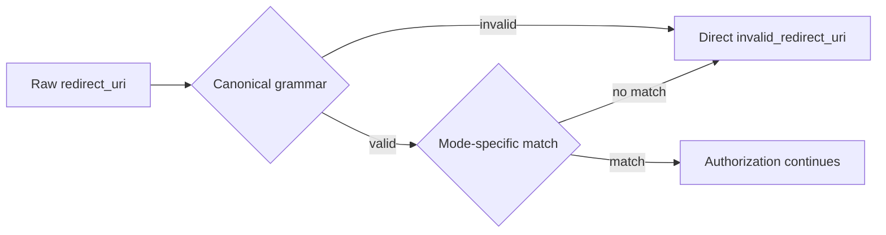

# Why redirect URI checks use exact strings

An OAuth redirect sends the browser to a URI chosen during authorization. If the server accepts a broader or differently normalized URI than the client registered, an authorization code can be sent to an attacker-controlled destination.

`mcp-sso` validates redirect entries before it compares them. The same grammar is used at configuration, registration, authorization, CIMD validation, signed-cookie reads, consent-token reads, and authorization-code exchange.

## The rule

Each redirect entry is either an origin or an exact URI:

```text
origin:    https://client.example
exact URI: https://client.example/oauth/callback
```

An origin intentionally trusts every path on that origin. An exact URI trusts one canonical string. Entries cannot contain a query, fragment, userinfo, wildcard, malformed escape, control character, or non-canonical host, port, or path spelling. Plain HTTP is limited to loopback hosts.

> [!WARNING]
> Adding `https://client.example` trusts every path on that origin. Use `https://client.example/oauth/callback` when the client has one stable callback.

## Why the server rejects instead of normalizing

URL parsers fold several different strings into one URL. They lowercase hosts, remove default ports, resolve dot segments, and can erase syntax such as empty userinfo. If the server normalizes before comparing, a client can present bytes that were never registered and still reach the registered destination.



For example, `HTTPS://CLIENT.EXAMPLE:443/x/../oauth/callback` parses to the same URL as `https://client.example/oauth/callback`. `mcp-sso` rejects the first spelling instead of folding it into a match.

## The three matching policies

| Client path | Match |
| --- | --- |
| Stateless DCR | Exact entry, trusted origin, or explicitly configured portless loopback origin |
| Stored DCR with `application_type="web"` | Every saved redirect must still pass the current `BridgeConfig.redirectAllowlist`. The presented URI must then equal the saved raw string. |
| Stored DCR with `application_type="native"` | Every saved redirect must still pass the current `BridgeConfig.redirectAllowlist`. The presented loopback URI must then keep the saved scheme, host, and path. Queries are forbidden. The runtime port may differ. |
| CIMD | Exact raw string. A validated loopback HTTP entry may vary only its port when `application_type` is `"native"` or absent. |

The loopback port exception exists because native clients bind an available local port at runtime. It does not widen the host or path. A registration for `http://127.0.0.1/callback` does not match `http://127.0.0.1/other`.

## Why checks repeat at reads

A record or signed token can outlive the code version that created it. Checking only at registration leaves pre-upgrade records, in-flight cookies, consent tokens, and authorization codes able to carry a redirect that the new grammar rejects.

The repeated checks are stored-state siblings. Each consumer validates the value again before it redirects, persists a code, or mints a token. Stored DCR authorization also rechecks the saved redirects against the current global allowlist, so removing an allowlist entry takes effect immediately. The archived [2026-08-17 implementation record](../archive/2026-08-17-redirect-entry-grammar.md) preserves the parser measurements that led to this design. [Contract §10](../contracts/10-redirect-uri-policy.md) is the current reference.
